# Video Processing Pipeline

## Overview

This project implements an asynchronous AWS-based video processing pipeline.

- A source video is uploaded to a temporary S3 bucket.
- S3 emits an event to SQS.
- A Node.js poller service reads SQS messages and launches an ECS Fargate task.
- The ECS container downloads the source video, transcodes it into multiple resolutions using `ffmpeg`, uploads outputs to a production S3 bucket, and exits.

## Tech Stack

- Node.js 20
- TypeScript (poller service in `src/index.ts`)
- JavaScript (transcoder container in `container/index.js`)
- AWS SDK v3 (`@aws-sdk/client-sqs`, `@aws-sdk/client-ecs`, `@aws-sdk/client-s3`)
- Amazon S3 (temp uploads and production outputs)
- Amazon SQS (event queue)
- Amazon ECS Fargate (transcoding task runtime)
- Docker (container packaging)
- ffmpeg + fluent-ffmpeg (video transcoding)

## Architecture

```mermaid
flowchart LR
    user([User]) -->|Upload <= 100MB| temp[(S3 Temp Bucket)]
    temp --> sqs[SQS Queue]

    subgraph poller[Node.js Poller Service]
      p1[Poll SQS]
      p2[Validate S3 Event]
      p1 --> p2
    end

    sqs -->|Poll| p1
    p2 -->|RunTask| ecs[ECS Fargate Task\nvideo-transcoder]

    ecs -->|Download original| temp
    ecs --> ffmpeg[ffmpeg Transcoding]
    ffmpeg -->|Upload renditions| prod[(S3 Production Bucket)]
    ffmpeg -.->|Task exits after completion| kill([Container Stops])

    classDef userNode fill:#EAF2FF,stroke:#2F6FED,color:#0F2A63,stroke-width:2px;
    classDef s3Node fill:#E9F9EE,stroke:#2E9B4F,color:#14532D,stroke-width:2px;
    classDef sqsNode fill:#FFF1F7,stroke:#E11D8A,color:#831843,stroke-width:2px;
    classDef pollNode fill:#FFF9E8,stroke:#D97706,color:#7C2D12,stroke-width:2px;
    classDef ecsNode fill:#EEF2FF,stroke:#4F46E5,color:#312E81,stroke-width:2px;
    classDef ffmpegNode fill:#F4F4F5,stroke:#18181B,color:#09090B,stroke-width:2px;
    classDef stopNode fill:#FEE2E2,stroke:#DC2626,color:#7F1D1D,stroke-width:2px;

    class user userNode;
    class temp,prod s3Node;
    class sqs sqsNode;
    class p1,p2 pollNode;
    class ecs ecsNode;
    class ffmpeg ffmpegNode;
    class kill stopNode;
```



## Usage (Local Setup)

### 1. Prerequisites

- Node.js `>=20`
- npm or pnpm
- Docker Desktop (for container testing)
- AWS credentials configured locally (recommended: `aws configure` or environment variables)
- AWS resources created and wired:
  - Temp S3 bucket with S3 -> SQS notification
  - SQS queue
  - ECS cluster + Fargate task definition named `video-transcoder`
  - Production S3 bucket for transcoded outputs
  - Network settings (subnets/security group) valid for your ECS task

### 2. Install dependencies

Project root:

```bash
pnpm install
```

Container package:

```bash
cd container
npm install
cd ..
```

### 3. Configure project values

Update these values in [src/index.ts](/g:/New/video-processing-pipeline/src/index.ts):

- `QUEUE_URL`
- ECS `taskDefinition`
- ECS `cluster`
- `awsvpcConfiguration.subnets`
- `awsvpcConfiguration.securityGroups`

Update output bucket in [container/index.js](/g:/New/video-processing-pipeline/container/index.js):

- `PutObjectCommand -> Bucket` (currently `production.chidambar.com`)

### 4. Run the poller locally

```bash
pnpm run dev
```

This compiles TypeScript and starts the SQS polling service from `dist/index.js`.

### 5. Test the transcoder container locally

Build image:

```bash
cd container
docker build -t video-transcoder:local .
```

Run image (provide the source object):

```bash
docker run --rm \
  -e AWS_REGION=us-east-2 \
  -e BUCKET=<temp-bucket-name> \
  -e KEY=<input-video-key> \
  -e AWS_ACCESS_KEY_ID=<your-key> \
  -e AWS_SECRET_ACCESS_KEY=<your-secret> \
  video-transcoder:local
```

The container downloads the input object, transcodes into `360p`, `480p`, and `720p`, uploads outputs to the production bucket, and exits.

### 6. End-to-end check

1. Upload a sample video to the temp bucket.
2. Confirm an SQS message is created.
3. Confirm poller logs show message receipt and ECS task launch.
4. Confirm ECS task completes successfully.
5. Verify transcoded files exist in the production bucket.
